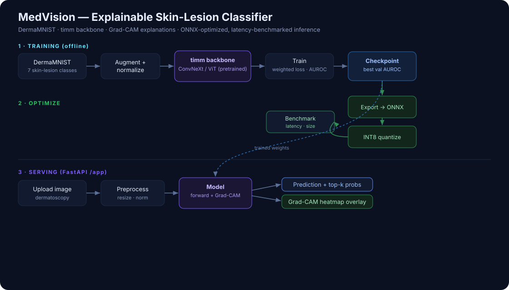

# MedVision — Explainable Skin-Lesion Classifier

[](https://github.com/ahmadad0111/medvision/actions/workflows/ci.yml)

A production-grade, **explainable** medical-image classifier: it predicts one of
7 skin-lesion types from a dermatoscopic image, shows **why** with a Grad-CAM
heatmap, and serves predictions through an **ONNX-optimized, latency-benchmarked**
FastAPI service with a web UI.

> Research/education demo only — not a medical device, not for diagnosis.
> Trained on the public **DermaMNIST** dataset (HAM10000-derived).

What makes it more than a Kaggle notebook:

- **Explainability** — Grad-CAM heatmaps for every prediction (the pixels that drove the decision).
- **Modern backbone** — any `timm` model (default `convnext_tiny`; ViT works too) via transfer learning.
- **Rigorous training** — class-imbalance handling (weighted loss), label smoothing, cosine schedule, and per-epoch accuracy / macro-F1 / **macro-AUROC**, with best-checkpoint selection and optional Weights & Biases.
- **Inference optimization** — export to ONNX, INT8 quantization, and a benchmark reporting latency + model size across PyTorch / ONNX / INT8.
- **Deployed** — FastAPI `/predict` endpoint + a streaming-free, dependency-light web UI at `/app`, containerized with Docker and covered by GitHub Actions CI.

## Architecture



## Quick start

```bash
cp .env.example .env

# 1. Train (auto-downloads DermaMNIST on first run)
pip install -r requirements.txt
python -m scripts.train            # writes artifacts/model.pt + artifacts/test_report.json

# 2. Export to ONNX + INT8 and benchmark latency/size
python -m scripts.export           # writes artifacts/benchmark.json

# 3. Serve (Docker mounts ./artifacts so it can load your trained model)
docker compose up --build -d
# open http://localhost:8000/app  → upload a lesion image → prediction + Grad-CAM
```

Run the API without Docker: `uvicorn src.api.main:app --reload` (after training).

## API

| Method | Path | Description |
|---|---|---|
| POST | `/predict?explain=true` | Image upload → `{prediction, top_k, gradcam_png_base64, latency_ms}` |
| GET | `/health`, `/version` | Health + config + label map |

## Configuration

Everything is env-driven — see `.env.example`. Highlights: `BACKBONE`
(any timm model), `IMG_SIZE`, `EPOCHS`, `BATCH_SIZE`, `LR`,
`USE_CLASS_WEIGHTS`, `USE_WANDB`, `DEVICE`.

## Results

ConvNeXt-Tiny fine-tuned on DermaMNIST (7 classes, 224px, 15 epochs) — on par
with published MedMNIST baselines.

| Metric (test) | Value |
|---|---|
| Accuracy | **0.748** |
| Macro-F1 | 0.558 |
| **Macro-AUROC** | **0.908** |

**Per-class recall**

| Class | Recall |
|---|---|
| melanocytic nevi (benign) | 0.85 |
| vascular lesions | 0.72 |
| basal cell carcinoma | 0.60 |
| actinic keratoses | 0.59 |
| melanoma | 0.53 |
| benign keratosis-like | 0.51 |
| dermatofibroma | 0.39 |

**Error analysis.** The dominant error is the clinically important
melanoma↔nevi boundary: 57/223 melanomas were predicted as benign nevi
(false negatives) and 101 nevi were over-called as melanoma. Raising
`WEIGHT_POWER` toward 0.7 trades a little accuracy for higher melanoma recall —
often the desirable clinical tradeoff. Full confusion matrix in
`artifacts/test_report.json`.

**Inference benchmark** (CPU, 1 image, 50 runs)

| Engine | Latency (ms) | Size (MB) | vs PyTorch |
|---|---|---|---|
| PyTorch fp32 | 113.5 | 106.2 | 1.0x |
| **ONNX fp32** | **33.4** | 106.2 | **3.4x faster** |
| ONNX INT8 | n/a* | **26.9** | **3.9x smaller** |

\* INT8 *inference* is omitted — quantized ConvNeXt ops hard-crash ONNX Runtime
on this CPU — but the INT8 export still yields a **3.9x smaller model**
(106 → 27 MB). Exporting to ONNX alone cut CPU latency **3.4x** (113 → 33 ms).

## Tests

```bash
pip install pytest
pytest -q     # pure-logic tests: metrics (acc/F1/AUROC), config, inference utils
```

## Project structure

```
src/
  core/         config, logging, seed
  data/         DermaMNIST pipeline (medmnist) + class weights
  models/       timm backbone factory + Grad-CAM target detection
  training/     trainer (weighted loss, AUROC, checkpointing) + metrics
  explain/      Grad-CAM + heatmap overlay
  inference/    Predictor (label, top-k, Grad-CAM)
  export/       ONNX export, INT8 quantization, latency benchmark
  api/          FastAPI app, routes (health, predict), schemas, DI
scripts/        train.py, export.py, push_all_branches.sh
frontend/       upload UI with probability bars + heatmap
tests/          unit tests
```

## Development workflow

Branch-per-feature merged into `release/v1.0`: `feature/data-model` →
`feature/training` → `feature/explainability` → `feature/onnx-benchmark`
→ `feature/api-ui` → `feature/ci-docs`.

## Troubleshooting

**`A module compiled using NumPy 1.x cannot be run in NumPy 2.x` / medmnist `RuntimeError: Failed to...`**
Your PyTorch was built against NumPy 1.x but the env has NumPy 2. Fix:

```bash
pip install "numpy<2"
```

Then re-run `python -m scripts.train`.

**`RuntimeError: Unknown model (convnext_tiny)`**
Your `timm` is older than the requested backbone. Either upgrade (`pip install -U timm`) or use a backbone your version has:

```bash
set BACKBONE=resnet50   # Windows (use `export` on macOS/Linux)
python -m scripts.train
```

## Roadmap

Segmentation head, test-time augmentation, calibration (temperature scaling),
a Streamlit dashboard, and TensorRT/edge (Jetson) deployment benchmarks.
